# Government Support for Accessibility to Higher Education Among Underrepresented Groups in Massachusetts
## Assignment01: Heuristic Evaluation of Massachusetts
**Christina Cha | DH110 | FALL 2021**

---

## About the Project:
Access to higher education has always been a topic of conversation amongst high school and college students, especially high school seniors as they apply to their dream colleges and universities. The topic of accessibility for these institutions is a crucial conversation to have especially with many underrepresented groups lacking resources or opportunities to get into higher education. In addition, the glamourization of higher education and academia in the media further pushes away the focus from the issue of accessibility and how it can be resolved. In this project, I want to explore how the government tackles this issue. What resources has the government made available specifically for underrepresented groups? Have these programs and websites actually improved the amount of underrepresented students that get into these elite institutions? Government support for this issue plays a large role in making the future demographic within academia diverse. I hope to further dive into these topics and questions to understand the current government involvement in making a more diverse and inclusive future.

---

### Jakob Nielsen's [10 Usability Heuristics](https://www.nngroup.com/articles/ten-usability-heuristics/) Explained
|Number|Heuristic|Definition|
|---|---|---|
|1|**Visibility of System Status**|The design should always keep users informed about what is going on, through appropriate feedback within a reasonable amount of time.|
|2|**Match Between System and the Real World**|The design should be understandable for its users. It should use words, phrases, and concepts familiar to the user, rather than internal jargon. It should follow real-world conventions and present information in a natural and logical order.|
|3|**User Control and Freedom**| In the case that a user performs an action by mistake, the design should provide a clearly-marked "emergency exit" to quickly abandon the unwanted action. |
|4|**Consistency and Standards**| Words and phrases should have consistent meanings across the entire design, following platform and industry conventions where possible. |
|5|**Error Prevention**| The design should carefully prevent problems from occurring, whether through eliminating conditions that lead to errors or making users confirm their choice before completing an action. |
|6|**Recognition Rather than Recall**| The design should minimize the user's cognitive load by making elements, actions, and options easily visible. The design should be such that users do not have to remember information from other parts of the interface in order to use it. This required information should be visible or easy to locate on the design. |
|7|**Flexibility and Efficiency of Use**| The design should include shortcuts usable for expert users, so that it is equally usable for users of all experience levels. It should also allow users to tailor frequent actions. |
|8|**Aesthetic and Minimalist Design**| The interface should only contain information that is relevant or needed often, as every additional piece of information competes with others for user attention and diminishes others' relative visibility. |
|9|**Help Users Recognize, Diagnose, and Recover from Errors**| Error messages should be easily understandable, precisely indicate the problem, and constructively suggest a solution. |
|10|**Help and Documentation**| If needed, the design must include documentation to guide users in completing certain tasks.

### [Severity Ratings for Usability Problems](https://www.nngroup.com/articles/how-to-rate-the-severity-of-usability-problems/) by Nielsen Norman Group
|Rating|Description|
|---|---|
|1|Cosmetic problem only: need not be fixed unless extra time is available on project|
|2|Minor usability problem: fixing this should be given low priority|
|3|Major usability problem: important to fix, so should be given high priority|

##### _CHART STYLE CREDIT: Emily Dong from Spring 2021_

---

## Website 1: [Massachusetts Educational Financing Authority](https://www.mefa.org/)
### About the Website
Massachusetts Educational Financing Authority (MEFA) was established by the Massachusetts state legislature in 1982 with the goal of helping students afford higher education through various financial programs. MEFA also provides families guidance on preparing for college starting from kindergarten through college. 

I will be examining MEFA’s website through the lens of a high school/college student who is researching and learning about how to get financial aid. Information organization and easy navigation will be a crucial part for this specific perspective as it can affect the student’s ability to pay for college.  

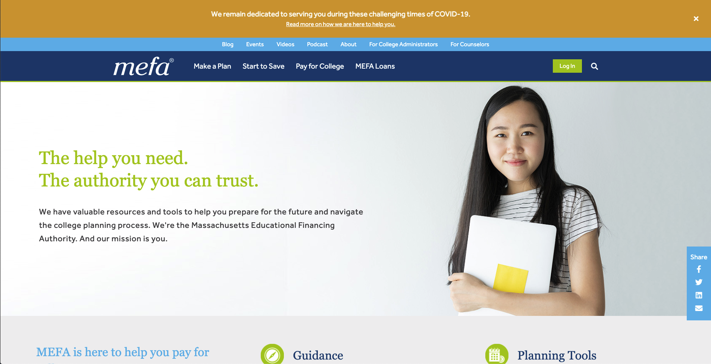
https://www.mefa.org/

### Heuristic Evaluation
#### **Overall Evaluation:**

MEFA’s website is overall tailored for both students and parents. The simplistic consistent design and layout allows most people regardless of age to navigate through the website based on their needs without having to dig through the entire website. When searching for basic information like how to get a loan or how to apply for financial aid, the website makes it easy to navigate. However, if a user wanted to search something specific through the search bar, they would have a hard time as the search bar provides no suggestion or guidance in the case the user makes an error.

#### **1. Visibility of System Status**

For all of their search bars, there is no automatic search suggestion in relation to what you are typing. Usually, search bars would show some suggestions after a couple letters. However, for MEFA, the suggestions do not show up no matter how many letters you input. The absence of this feature drops the efficiency of the search by a lot, especially for someone who is visiting the website for the very first time. 

_Severity Rating: 2_

> **Solution:** I would suggest having the automatic article suggestions pop up filtered by “most searched” from the moment the student types the first letter. This allows the student to quickly understand what type of resources and articles MEFA provides in relation to the words they are typing. 

#### **2. Match Between System and the Real World**

The “Plan for College by Age” section reflects how the rest of MEFA’s website utilizes icons. For the most part, they accurately match the icon to the actual service/object (e.g. graduation cap for college or graduate school, or parent holding child’s hand for grade school). But throughout the website, including the screenshot below, the icons for specific sections are less intuitive and sometimes hard to match to the real world example. 

_Severity Rating: 1_

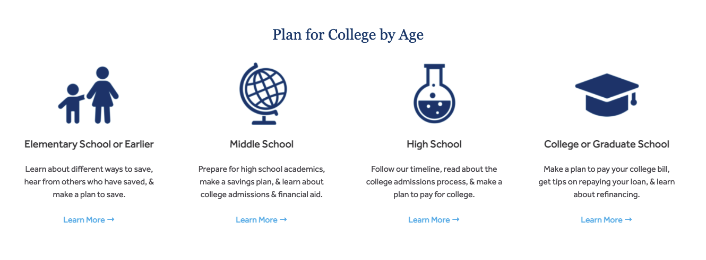

> **Solution:** I would suggest using actual numbers to represent the different grades in school (e.g. K-5th for elementary, 6-8th for middle school) rather than using unrelated and/or general icons like the globe and chemistry icon for middle and high school respectively. 

#### **3. User Control and Freedom**

One good element of the search bar is that after you type a word and click “Search”, the phrase or word typed stays in the search bar. This improves efficiency as it allows the user to go back, edit spelling mistakes, or change a part of the phrase. This is helpful since the users are prone to more mistakes with no automatic search suggestions embedded into the search bar. In addition to the search bar, MEFA’s website overall makes it easy to navigate through various pages by either going to the previous page with one click, or going to a completely different section of the website through the tabs at the top of their website.

_Severity Rating: Satisfactory_

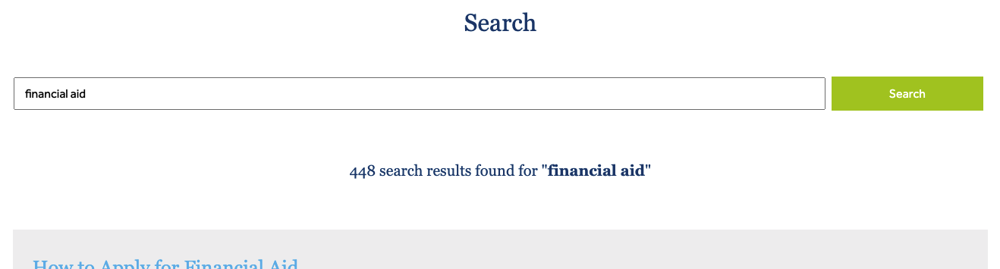

#### **4. Consistency and Standards**

The overall wording, tone, and design of MEFA’s website is consistent throughout various pages. However, the way they organize their tabs is slightly confusing especially for “Make a Plan” and “Start to Save”. This is due to the fact that when you hover over “Start to Save” and look at the dropdown menu, a lot of the sub-tabs are titled “...Plan” at the end, whereas “Make a Plan” has a dropdown menu with sub-tabs related to the different stages a student is in.

_Severity Rating: 1_

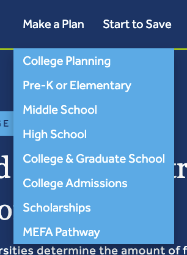

> **Solution:** I would suggest switching the main tab title names to better align with the subcategories in the dropdown menu. This allows students and other users to navigate and process the categories faster. 

#### **5. Error Prevention**

MEFA’s websites, especially their online calculators, do a great job in preventing errors as it provides clear error signals (e.g. red box around missing sections of the calculator, or pop-up messages that notifies the user to double check their information).

_Severity Rating: Satisfactory_

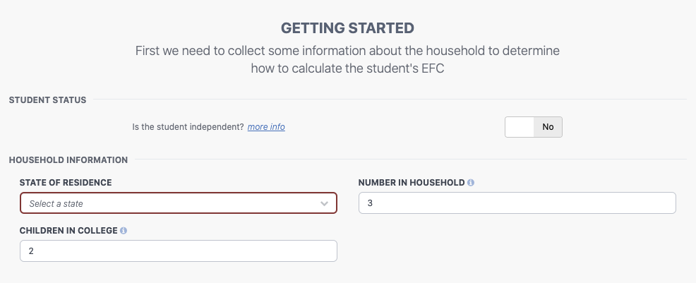
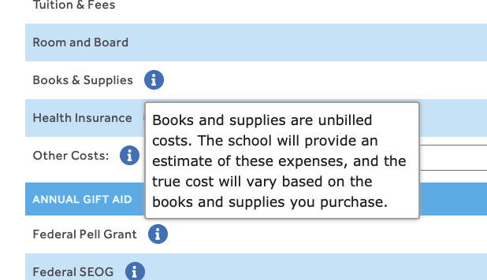

#### **6. Recognition Rather Than Recall**
Overall, MEFA does a good job of making the actions and options easily visible to the user. For example, the tabs at the top are split into four clear sections: Make a Plan, Start to Save, Pay for College, and MEFA Loans. This makes it easy for the student or user to navigate through the website based on their needs.

_Severity Rating: Satisfactory_

#### **7. Flexibility and Efficiency of Use**
Due to the simplicity of website design, most of the features and functionality of MEFA’s website is easy and flexible to use for any type of user, especially for students who can be more tech-savvy and familiar with using websites like these. In addition, the tabs and clear sections within the websites makes it easy to use without having to struggle to search for what they need.

_Severity Rating: Satisfactory_ 

#### **8. Aesthetic and Minimalist Design**
MEFA’s website has a good color palette that is pleasing to the eye with minimal website layout. However, there is one part of the website that glaringly stuck out which is the thin tab sections above the main four tab categories. The sections like “Blog”, “For Counselors” and “Events” seem unnecessary for the main type of users which are students and families. This section distracts the user from the main focus, which is finding ways to plan and finance their education.

_Severity Rating: 2_

> **Solution:** I would suggest placing that section towards the end of the website where all the other detailed information is located. Another option is having a fifth tab next to the four main tabs where it compiles all the different sections into a dropdown. 

#### **9. Help Users Recognize, Diagnose, and Recover From Errors**
As mentioned previously, MEFA’s online calculators have clear indicators that tell the user what the issue is (e.g. a red outline on the sections that the user did not fill out). However, there is one part of the website where it leads the user to a dead end: the search bar. When I searched something that produced zero search results in the search bar, all the website did was display a text that said “0 search results found for searched word”. This would either make the user spend more time in finding the right words to find some information, or force them to quit searching. 

_Severity Rating: 2_

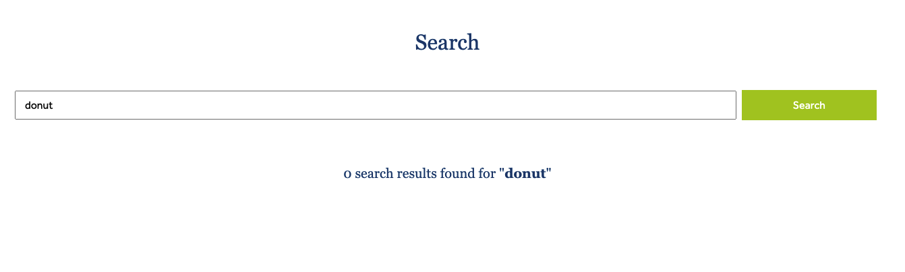

> **Solution:** I would suggest adding a “Did you mean…” where they suggest different search terms and phrases in the case the user misspells a word. Another suggestion is to add similar or related articles below in order to give the user some guidance. 

#### **10. Help and Documentation**
With a complicated topic and process like financial aid, MEFA overall does a good job in guiding the users on where to click for specific requests like loans or planning. For example, in the front page, MEFA provides direct links to four key sections based on the different types of needs. In this case, they put a guide for Guidance, Planning Tools, Savings Products, and Loan Products.

_Severity Rating: Satisfactory_  

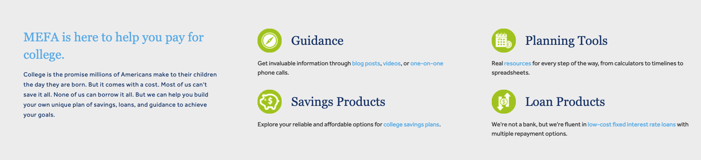

---

## Website 2: [Massachusetts Department of Higher Education's Office of Student Financial Assistance ](https://www.mass.edu/osfa/home/home.asp)
### About the Website
Massachusetts Department of Higher Education (DHE) is responsible for providing students in Massachusetts the proper resources and opportunities to ensure that diverse students get into higher education in order to not only improve their lives, but also to develop Massachusetts as a state through the students’ future contributions. I will be focusing on the Office of Student Financial Assistance (OSFA), a division under DHE that focuses on providing guidance, tools, and resources to help students obtain financial aid and support. Just like their name, OSFA offers aid through various types of financial support including grants, scholarships, loans, tuition waivers, and so on. 

Similarly to MEFA, I will be examining OSFA’s website through the lens of a high school/college student who is researching and learning about how to get financial aid. Information organization and easy navigation will be a crucial part for this specific perspective as it can affect the student’s ability to pay for college.  

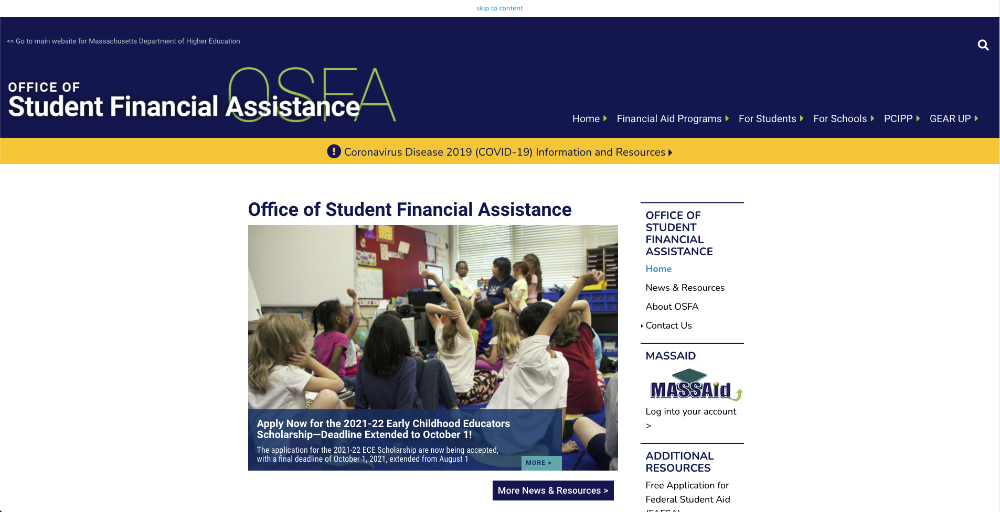
https://www.mass.edu/osfa/home/home.asp

### Heuristic Evaluation
#### **Overall Evaluation:**
OSFA’s website's simple, straightforward design works for various types of people, especially students. However, there are key elements throughout the website that can use improvements including the utilization of white space and space in general and the search bar suggestion feature. 

Heuristic Evaluation
#### **1. Visibility of System Status**
Just like MEFA, there is no automatic search suggestion in relation to what you are typing in OSFA’s search bar. Instead of having a drop down menu with article suggestions, they depend on the user writing their full phrase out making it less efficient. 

_Severity Rating: 2_

> **Solution:** I would suggest having the automatic article suggestions show up based on the most clicked or most searched allowing users to find the information that they need quickly and efficiently. 

#### **2. Match Between System and the Real World**
OSFA’s style of language and tone reflects the clear direct language that is easily understood by students. However, the website mostly focuses on having text to represent their information and lacks a lot of icons and visual signals which can decrease the efficiency amongst users especially when trying to navigate through a lot of resources. 

_Severity Rating: 2_

> **Solution:** I would suggest including clear sections within the website with corresponding icons in order to guide users where to look for specific types of information. It would be best to put the icons in the front page as that is the first part of the website the user sees. 

#### **3. User Control and Freedom**
Users are able to navigate through the website without having to actively search for an “emergency exit”. However, when you press search after typing in the search bar, the website deletes the word/phrase you typed making it hard for users to undo any mistake they might have made when typing (e.g. spelling error, grammar mistake, etc.) This can decrease the efficiency as it forces users to spend more time retyping or editing their phrase instead of having an emergency exit solution.

_Severity Rating: 2_

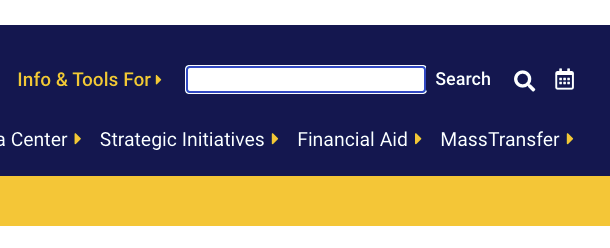

> **Solution:** I would suggest implementing a feature where the text the user searched previously stays in the search box or providing a “Did you mean…” section where they automatically provide suggestions based on what the user wrote. This would allow the user to save time and find the resources and information quicker. 

#### **4. Consistency and Standards**
OSFA keeps a consistent style of design and language throughout the website. The color palette and font hierarchy stays the same on almost every page providing a cohesive look and feel. This makes it easy for users to recognize the website and its purpose when visiting it again. 

_Severity Rating: Satisfactory_

#### **5. Error Prevention**
The website has little instances where errors can occur. However, a good example of error prevention is the “Info & Tools for Schools” section where users can click the “+” to open up the various categories for more information or click “x” after to close it. This is especially helpful for users when they did not mean to click open a certain category. 

_Severity Rating: Satisfactory_ 

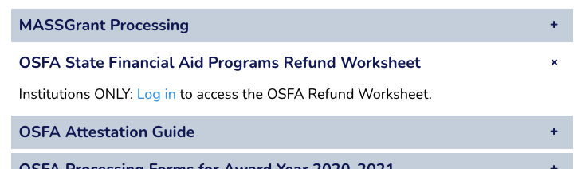

#### **6. Recognition Rather Than Recall**
The website lacks icons and the explanation of certain acronyms making it difficult for users to recognize certain cues until they click the category where it goes into more detail. For example, one of the tabs at the upper right side is titled PCIPP. If a user has never visited the website, they would have a hard time deciphering what the acronym stands for. In addition, at the bottom of the screen in the footer, another acronym SARA can be seen.

_Severity Rating: 2_

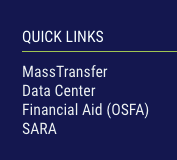

> **Solution:** Write out the acronym for users to quickly process what certain sections and tabs of the website are meant for without having to click through. 

#### **7. Flexibility and Efficiency of Use**
Because the website is straightforward with six tabs and dropdown menus, any type of user, especially students and parents, can navigate through easily. In addition, the sections are organized in a way where the user does not have to click through 2 to 3 different tabs and links in order to reach a certain page. They just simply need to click on the dropdown menu in the tabs. 

_Severity Rating: Satisfactory_ 

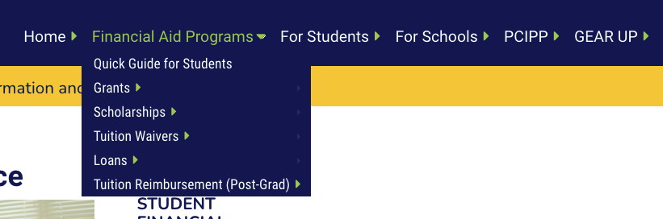

#### 8. Aesthetic and Minimalist Design
The website has a consistent aesthetic and color scheme while staying simple in terms of the user journey. However, in the home page, there is a notable imbalance between the large photo and the white space below it. In addition, there is a large amount of text on the side which can be overwhelming for some users.

_Severity Rating: 1_ 

> **Solution:** I would suggest utilizing the bottom white space to create visual sections and cues to replace the text based sections on the side. 

#### 9. Help Users Recognize, Diagnose, and Recover From Errors
As mentioned previously, OSFA’s search bar lacks the automatic search suggestion which prevents users from quickly recognizing and diagnosing their mistakes. 

_Severity Rating: 2_

> **Solution:** I would suggest including either a “Did you mean…” section to help users recover from errors fast or automatic search suggestion in order to prevent users from making a mistake in the first place. 

#### 10. Help and Documentation
Almost each section on OSFA’s website includes some form of guidance and documentation through PDFs. This ensures that the users will have enough information to breakdown and understand the different options the user has for financial aid and support. 

_Severity Rating: Satisfactory_ 

