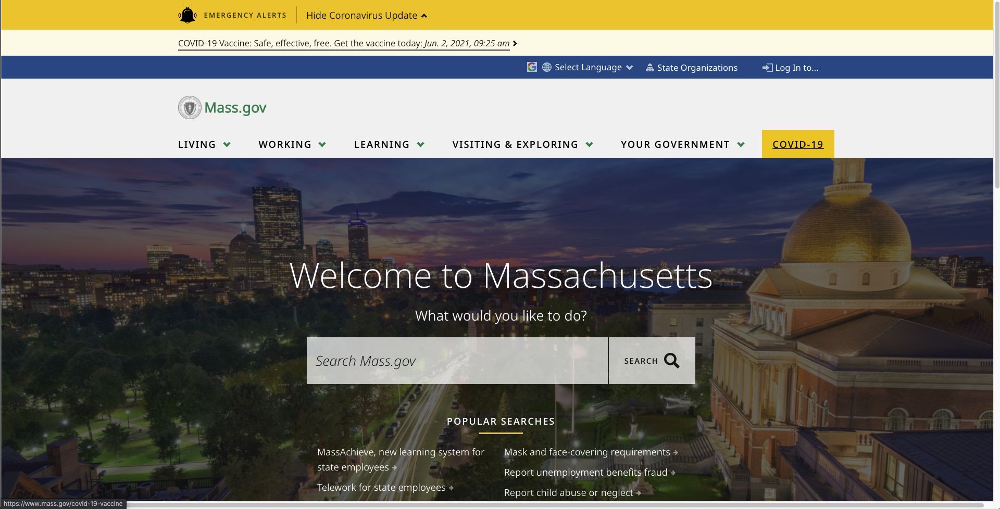

# Government Support for Accessibility to Higher Education Among Underrepresented Groups in Massachusetts
## Assignment01: Heuristic Evaluation of Massachusetts
**Christina Cha | DH110 | FALL 2021**

---

## About the Project:
Access to higher education has always been a topic of conversation amongst high school and college students, especially high school seniors as they apply to their dream colleges and universities. The topic of accessibility for these institutions is a crucial conversation to have especially with many underrepresented groups lacking resources or opportunities to get into higher education. In addition, the glamourization of higher education and academia in the media further pushes away the focus from the issue of accessibility and how it can be resolved. In this project, I want to explore how the government tackles this issue. What resources has the government made available specifically for underrepresented groups? Have these programs and websites actually improved the amount of underrepresented students that get into these elite institutions? Government support for this issue plays a large role in making the future demographic within academia diverse. I hope to further dive into these topics and questions to understand the current government involvement in making a more diverse and inclusive future.

---

### Jakob Nielsen's [10 Usability Heuristics](https://www.nngroup.com/articles/ten-usability-heuristics/) Explained
|Number|Heuristic|Definition|
|---|---|---|
|1|**Visibility of System Status**|The design should always keep users informed about what is going on, through appropriate feedback within a reasonable amount of time.|
|2|**Match Between System and the Real World**|The design should be understandable for its users. It should use words, phrases, and concepts familiar to the user, rather than internal jargon. It should follow real-world conventions and present information in a natural and logical order.|
|3|**User Control and Freedom**| In the case that a user performs an action by mistake, the design should provide a clearly-marked "emergency exit" to quickly abandon the unwanted action. |
|4|**Consistency and Standards**| Words and phrases should have consistent meanings across the entire design, following platform and industry conventions where possible. |
|5|**Error Prevention**| The design should carefully prevent problems from occurring, whether through eliminating conditions that lead to errors or making users confirm their choice before completing an action. |
|6|**Recognition Rather than Recall**| The design should minimize the user's cognitive load by making elements, actions, and options easily visible. The design should be such that users do not have to remember information from other parts of the interface in order to use it. This required information should be visible or easy to locate on the design. |
|7|**Flexibility and Efficiency of Use**| The design should include shortcuts usable for expert users, so that it is equally usable for users of all experience levels. It should also allow users to tailor frequent actions. |
|8|**Aesthetic and Minimalist Design**| The interface should only contain information that is relevant or needed often, as every additional piece of information competes with others for user attention and diminishes others' relative visibility. |
|9|**Help Users Recognize, Diagnose, and Recover from Errors**| Error messages should be easily understandable, precisely indicate the problem, and constructively suggest a solution. |
|10|**Help and Documentation**| If needed, the design must include documentation to guide users in completing certain tasks.

### [Severity Ratings for Usability Problems](https://www.nngroup.com/articles/how-to-rate-the-severity-of-usability-problems/) by Nielsen Norman Group
|Rating|Description|
|---|---|
|1|Cosmetic problem only: need not be fixed unless extra time is available on project|
|2|Minor usability problem: fixing this should be given low priority|
|3|Major usability problem: important to fix, so should be given high priority|

---

## Website 1: [Massachusetts Educational Financing Authority](https://www.mefa.org/)
### About
Massachusetts Educational Financing Authority (MEFA) was established by the Massachusetts state legislature in 1982 with the goal of helping students afford higher education through various financial programs. MEFA also provides families guidance on preparing for college starting from kindergarten through college. 

I will be examining MEFA’s website through the lens of a high school/college student who is researching and learning about how to get financial aid. Information organization and easy navigation will be a crucial part for this specific perspective as it can affect the student’s ability to pay for college.  

https://www.mass.gov/
