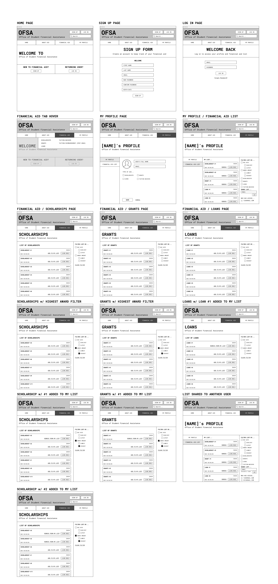
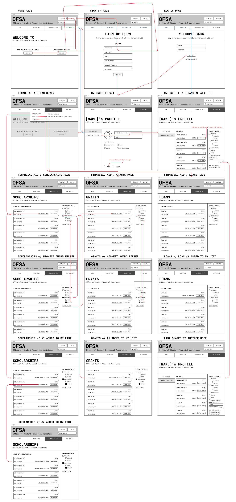

# Assignment 05: LowFiPrototype | Christina Cha, DH 110 F2021
---
## Overview
### _Purpose_
I will be redesigning the Massechusetts Office of Student Financial Assistance website as a mobile app for this project. Massachusetts OSFA is one of the offices within the Massachusetts Department of Higher Education that focuses on helping students finance their education, specifically for college. My main goal with this project is to redesign the website so that it easily caters to each individual’s financial needs and situation so that the website can recommend the proper scholarship, grants, loans, and other resources based on the individual’s criteria. 

For this assignment, I will be creating a low-fidelity prototype as it is an efficient and low-cost way to test the basic wireframes of a design before jumping into the final prototype and design of the product. In addition, testing the low-fidelity prototype allows us to test it and get feedback to see what problems we can fix and improve on during the early stages of the project. 

### _User Research_
Based on my research, I will focus on these three research questions:

- How might we improve the search system so it is more catered towards each individual and student’s financial situation?
- How might we organize the pages and tabs so users can accomplish tasks faster and more efficiently? 

### _Personas and Scenarios_
I created two personas: one based on my previous user research and one based on my own perceptions from the research. Below are the personas and scenarios. 

-  **Diana Kim:** A 17-year-old high school graduate with high technical literacy entering college who needs to efficiently find scholarships and grants that match her financial needs to attend her dream university: Harvard University. She wants to make sure she can keep track of which scholarships and grants she needs to apply to based on the award amount through her account.

- **Sandy Smith:** A 50-year-old homestay mom of two sons with low technical literacy and wants to find what type of scholarships and loans her son can apply to without a hassle in between her busy schedule. She wants to make sure her eldest son focuses on school without having to worry about which scholarships and loans he needs to apply to. She wants to easily create a list of applications her son can access. 

### _Tasks/Features_
- Directly filter out financial aid options (scholarships, grants, loans, etc) based on award amount and due date.
- Create a financial aid profile.
- Add financial aid options (scholarships, grants, loans, etc) to your account as a list to keep track of which ones to apply too. 
- Add collaborater to the financial aid list and account. 

---
## Low-Fidelity Prototypes
> Task 1: Filter out scholarship and grants based on award amount, due date, and other factors and add to your list (Begins with clicking tab on home page)

> Task 2: Create profile and add financial aid options to a list on your account to keep track. 
(Begins with clicking sign up on home page)

### _Wireframes_

### _Wireflow_

---
## Low-Fidelity Prototype Testing

---
## Reflection

