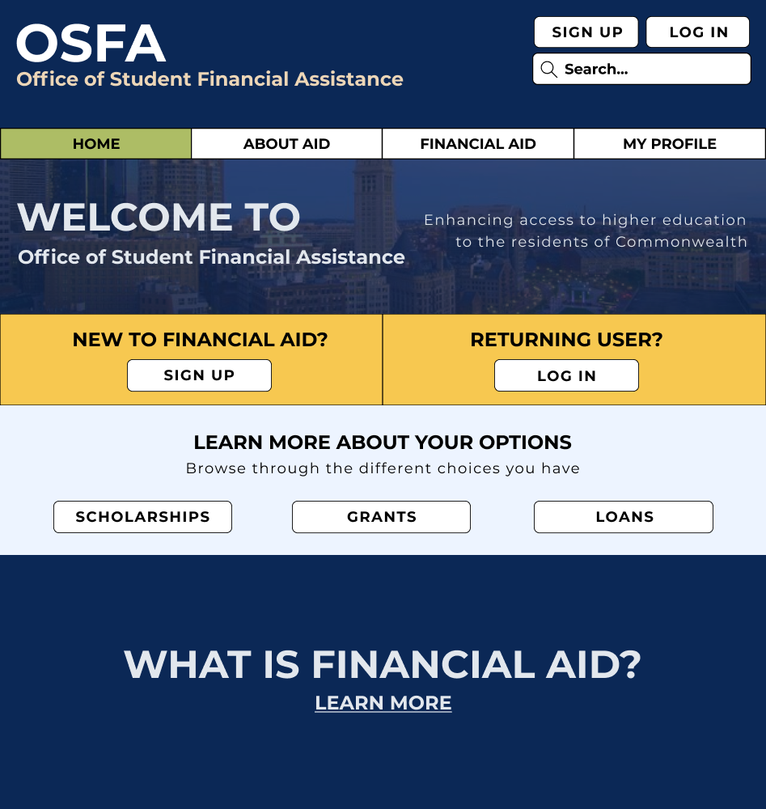
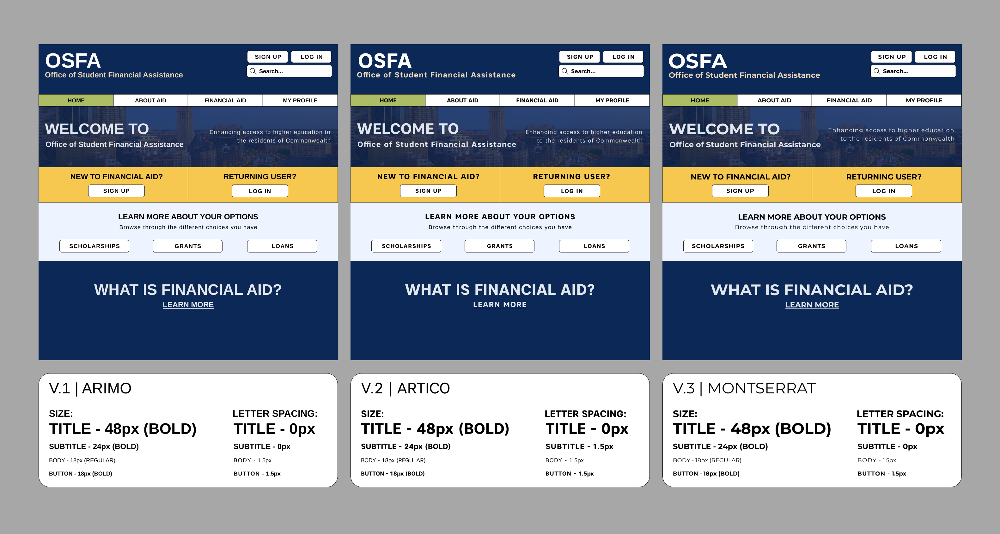
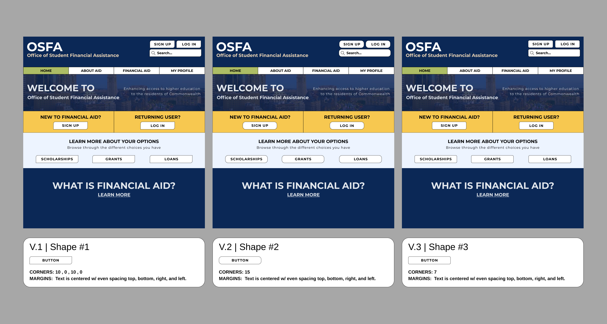
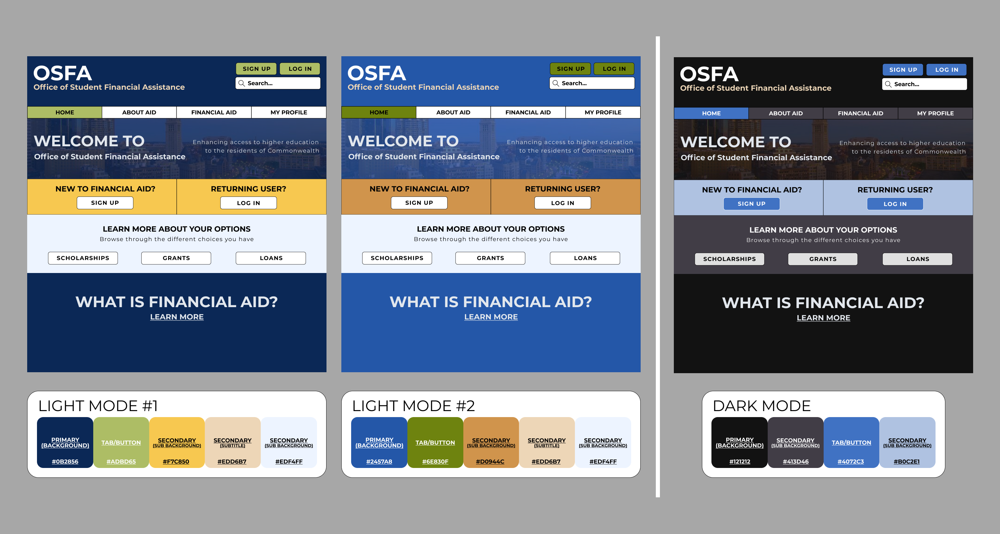
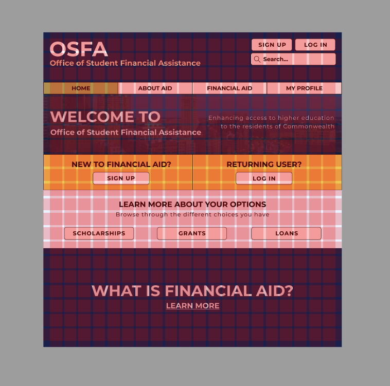
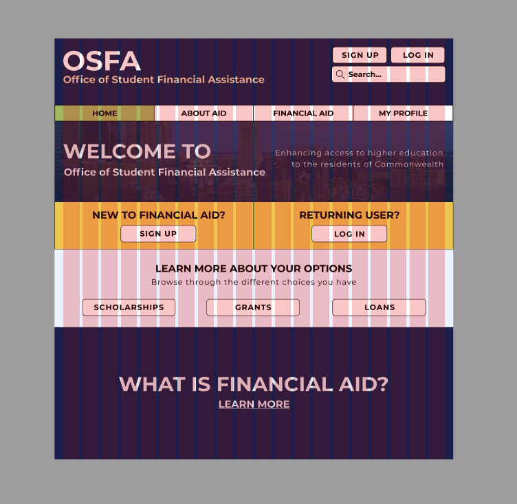

# Assignment 06: Interface Design | Christina Cha, DH 110 F2021
---
## Description of Project
I will be redesigning the Massechusetts Office of Student Financial Assistance website for this project. Massachusetts OSFA is one of the offices within the Massachusetts Department of Higher Education that focuses on helping students finance their education, specifically for college. My main goal with this project is to redesign the website so that it easily caters to each individual’s financial needs and situation so that the website can recommend the proper scholarship, grants, loans, and other resources based on the individual’s criteria and need. 

## Process 
For this assignment, I used Figma to design and test multiple variations of fonts, shapes, and colors for the website's interface. As I have already digitized my [low-fidelity wireframes from the previous assignment](https://github.com/ygcha/DH110-CHRISTINACHA/tree/main/assignment05), I went ahead and implemented various graphic and interactive componenets by starting with one wireframe, which in this case was the home page. I made sure that the font family, color scheme, and shapes fit and reflected the intention of this project: a government website that both parents and students can easily use to find and track information about financial aid in Massechusetts. 

## Purpose
The purpose of this assignment is to test multiple variations and see which element fit the website the best. When choosing the specific fonts, shapes, and colors, I made sure to choose the variation that suited an official government website the most. This meant that these elements had to convey a professional aesthetic to the users. I reviewed these variations with a participant to get insight on which elements I should go forward with. 

After trying various fonts, shapes, and colors, the wireframe below is an example of the current design of the website. 

**Here is the link to the Figma pages: **
- [LINK](https://www.figma.com/file/x0t5CUcYqjtNwrYgzNVRU7/?node-id=0%3A1) to screen designs.
- [LINK](https://www.figma.com/file/x0t5CUcYqjtNwrYgzNVRU7/?node-id=26%3A1646) to digitized wireflow w/ the designs implemeneted to the rest of my wireframes. 
- [LINK](https://www.figma.com/proto/x0t5CUcYqjtNwrYgzNVRU7/Assignment06?page-id=0%3A1&node-id=24%3A1524&viewport=241%2C48%2C0.26&scaling=min-zoom) to the prototype with the designs. 
---
## Screen Design
### Typography
Starting with the typography, I tested three different font families within the San Serifs typeface group: Arimo, Artico, and Montserrat. At first glance, the fonts look similar as they are all San Serifs typeface. However, the subtle differences in height, narrowness, and thickness made a noticeable effect on each wireframe as seen below.

Although I tested out three different font families, I standardized the specific measurements and style of the font as it fit all the different fonts that I tested. I made the the title, subtitle, and button bold as it made those key elements stand out much more. However, I kept the body text normal as it balanced the other bold text in the wireframes. As for the letter spacing, I kept the title and subtitle normal, 0px, and made the body and button 1.5px as the spaced out letters made the text more visible in a smaller size. 

#### Final Decision
Out of the three typography variations, I chose the Montserrat as the font family had clear line weights making the different texts clearly contrast each other (ex: title vs. body text). In addition, I felt that the width of each letter allowed users to clearly see which word and sentences without making the design feel outdated like the other two fonts. Montserrat provided the most clean look and harmony compared to the other two font families. 

### Shapes
Next, I tested out three different shapes for the buttons as my website implemented buttons on every single wireframe. The first button design was a leaf like shape where the top left and bottom right corners were rounded while the other two corners were sharp. The second button design was the classic rounded corners (15). Last but not least, the third button design was similar to the second button but less rounded in the corners, retaining most of the rectangular shape. 

As for the marigins, I kept a general rule of keeping the top and bottom spacing and the left and right spacing equal to each other as the button sizes would change throughout the wireframes depending on its purpose and space within the page.

#### Final Decision
Out of the three shape variations, I went with the third shape as it suited different button purposes. In addition, it reflected the professional aesthetic of a government website. Although the first button was more decorative and fun, the button style became overwhelming when having multiple buttons in one page. As for the second button, the higher level of corner rounding made it easy on the eyes, however, having multiple buttons of that style cheapened the overall aesthetic. 

### Color Scheme
Last but not least, I tested out a total of three color scheme variations: two light mode color schemes, and one dark mode color scheme. When curating the first color scheme for the website, I utlized almost every color of the logo's color scheme to reflect the branding on OSFA. In addition, I felt the colors of the logo suited a government website. For the second color scheme, I tried different colors within the same hue of the first color scheme to test out two different aesthetics. As for the dark mode color scheme, I utilized the #121212 color as my main background theme as recommended by [material.io](https://material.io/design/color/dark-theme.html#states) and used other dark gray colors for the rest of the components. In order to make certain elements, like the buttons, pop, I used a similar tone of blue from the light mode while making sure it was not too bright or saturated for a dark mode website.

#### Accessibility Check
To make sure my colors passed the accessibility check (color contrast), I used the Stark plug-in on Figma to test all three color schemes. The screenshots of the color contrast check can be seen in this [folder link](https://drive.google.com/drive/folders/1ZdtaMeuAD891QfxIGiLu9Xqv3-dLtgzv?usp=sharing). All of them passed the accessibility WCAG2.0 AA level. 

#### Final Decision
Out of the two light mode color schemes, I went with the first one as it gave the website more weight compared to the second color scheme. The dark navy blue as the background contrasted the white colored texts while the yellow gave clear attention to the sign up and log in buttons. 

### Grid Test
Below is two screenshots of the grid alignment of the home page. For this website, I used a 2120 grid to allow for flexibility in the placement of different elements while still providing a structured design. Some of the buttons aligned with the columns rather than the rows as I had to place it in the center along with the text. However, this did not dirupt the structure and overall organization of the website design.

 
