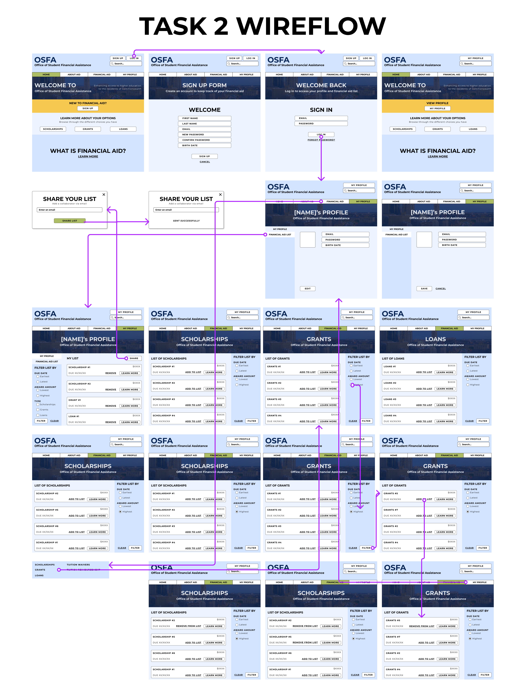

# Assignment 07: HighFiPrototype | Christina Cha, DH 110 F2021
---
## Description of Project
I will be redesigning the Massechusetts Office of Student Financial Assistance website for this project. Massachusetts OSFA is one of the offices within the Massachusetts Department of Higher Education that focuses on helping students finance their education, specifically for college. My main goal with this project is to redesign the website so that it easily caters to each individual’s financial needs and situation so that the website can recommend the proper scholarship, grants, loans, and other resources based on the individual’s criteria and need.

## Process
For this assignment, I used Figma to design and develop the rest of my high fidelity prototype. In addition, I took feedback from Professor Sookie and several classmates. I conducted two cognitive walkthoughs with two participants. With this feedback, I improved the designs and interaction of my prototype.  I made sure that my high fidelity prototype reflected the intention of this project: a government website that both parents and students can easily use to find and track information about financial aid in Massechusetts.

## Purpose
The purpose of this assignment is to not only implement the design to the rest of the wireframes, but also to test the high fidelity prototype through a cognitive walkthrough. A cognitive walkthough allows the designer to make sure users are able to carry out certain tasks using the product. It allows the designer to test the usability of the product.

## List of Tasks Supported by the Prototype

Task 1 - Create new profile, add 2 scholarships and 1 grant to the list based on award amount. 
Task 2 - Log-in, add 1 grant to the list based on award amount, and share the list via email. 

Specific tasks supported by the prototype:
> 1. Create a financial aid profile by signing up. 
> 2. Directly filter out financial aid options (scholarships and grants) based on highest award amount.
> 3. Add financial aid options (scholarships and grants) to your account as a list to keep track of which ones to apply too.
> 4. Share the financial aid list to another person via email.
> 5. Log in. 

These tasks are based on my two personas: Diana Kim and Sandy Smith.

> Diana Kim: A 17-year-old high school graduate with high technical literacy entering college who needs to efficiently find scholarships and grants that match her financial needs to attend her dream university: Harvard University. She wants to make sure she can keep track of which **scholarships and grants** she needs to apply to based on **the award amount **through her account.

> Sandy Smith: A 50-year-old homestay mom of two sons with low technical literacy and wants to find what type of scholarships and loans her son can apply to without a hassle in between her busy schedule. She wants to make sure her eldest son focuses on school without having to worry about which **grants** he needs to apply to. She wants to easily create a list of applications **she can share to her son through email**.

## Interactive Prototype 
[Link](https://www.figma.com/proto/hfFBBF6VnWhNXI6mfQEOqD/Assignment07?page-id=26%3A1646&node-id=127%3A3744&viewport=241%2C48%2C0.17&scaling=min-zoom&starting-point-node-id=127%3A3744) to the full prototype that supports both tasks

## Wireflow for Tasks

### Full Wireflow: 

### Task 1 Wireflow: 
Create new profile, add 2 scholarships and 1 grant to the list based on award amount. 

### Task 2 Wireflow: 
Log-in, add 1 grant to the list based on award amount, and share the list via email. 

## Cognitive Walkthrough
[Link](https://drive.google.com/file/d/1oVHaI5hgrsCfUm65sewfxODjMSF4pSFr/view?usp=sharing) to folder with screen and audio recording of cognitive walkthrough. Special thanks to Karlina Ho and Michael Canabarro for helping me with the walkthrough.

I conducted two cognitive walkthroughs with two classmates. In addition, also considered feedback from the cognitive walkthough we did during class.

### Summary and What I Learned
Overall, the cognitive walkthough went smoothly. When I conducted the walkthrough with my first participant Karlina, I was not sure whether I had to show the prototype task walkthough myself or have her navigate the prototype based on my task description. So for with Karlina, I showed her how to navigate the prototype through my screen and had her discuss her thoughts after the demonstration. With Karlina, she was able to understand the flow and logical progression of the website really well without much issue. She did mention that she wished there was an indicator of whether or not a scholarship/grant was successfully added which I agreed with. When I conducted my second walkthrough with Michael, I decided to have him navigate the prototype based on my task directions. This gave me a much clearer view of what the user was thinking when navigating through my prototype. It showed me what their logic progression was when going through the prototype. In terms of his experience, he was able to navigate through both tasks which out any problems. He also stated that the cancel/exit back-flows were easy to recognize as well. Both participants had a relatively easy time going through the tasks. 

## Design Changes
The cognitive walkthough gave me a clear idea of what elements I needed to add. 

Based on the cognitive walkthough, Karlina's point on adding a progress indicator for the financial aid adding was interesting. So I implemented that into my design. In addition, during class, one of my classmates mentioned that the yellow section in the home page from my first design was slightly confusing so I decided to reduce that into one box with one button as well. Last but not least, based on Professor Sookie's feedback, I changed the colors from dark mode to light mode where I implemented more dark text in front of a lighter background. 

### Change 1: 

### Change 2: 

### Change 3: 

